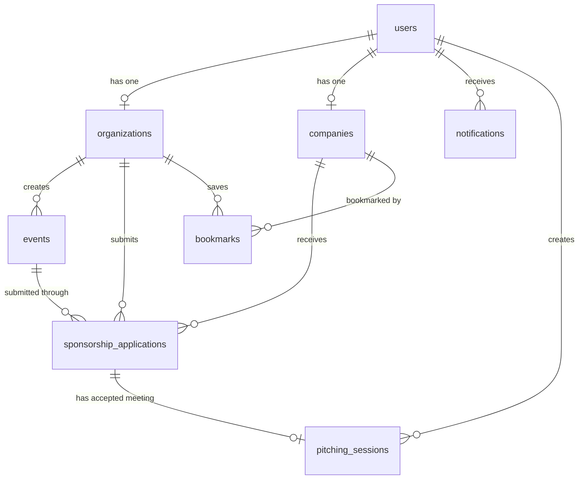

# DATABASE_RULES.md
# EVENTORA - Database Schema & Database Rules

## 0. Dokumen Metadata

| Item | Detail |
|---|---|
| Project | Eventora - Platform Digital Sponsorship Management System |
| Dokumen | DATABASE_RULES.md / DATABASE_SCHEMA.md |
| Versi | 1.0 |
| Target Stack | Laravel 11, MySQL 8.x, JWT Authentication |
| Tujuan | Menjadi pedoman database untuk migration, model, repository, API, testing, dan vibe coding |
| Sumber Acuan | PRD.md Eventora Version 1.0 |

---

## 1. Tujuan Dokumen

Dokumen ini menjelaskan aturan database Eventora secara rinci agar AI coding agent, backend developer, dan frontend developer memiliki sumber kebenaran yang sama.

Dokumen ini mengatur:

1. Struktur tabel database.
2. Relasi antar entitas.
3. Primary key, foreign key, unique key, dan index.
4. Enum status dan aturan transisi status.
5. Aturan cascade saat data dihapus.
6. Format field JSON.
7. Mapping database ke Laravel Model.
8. Aturan validasi data.
9. Query penting untuk API.
10. Larangan desain database agar tidak terjadi inkonsistensi.

---

## 2. Ringkasan Konsep Database

Eventora memiliki 3 role utama:

| Role | Tabel Utama | Fungsi |
|---|---|---|
| Admin | `users` | Mengelola user, event, sponsorship, dan laporan |
| Organisasi | `users` + `organizations` | Membuat event dan mengajukan sponsorship |
| Perusahaan | `users` + `companies` | Menerima, meninjau, menerima, atau menolak sponsorship |

Konsep inti sistem:

```text
1 user memiliki 1 role
1 user organisasi memiliki 1 profile organisasi
1 user perusahaan memiliki 1 profile perusahaan
1 organisasi dapat memiliki banyak event
1 event memiliki 1 proposal utama berupa PDF
1 event dapat diajukan ke banyak perusahaan
1 event tidak boleh diajukan dua kali ke perusahaan yang sama
1 sponsorship application menghubungkan event, organisasi, dan perusahaan
1 sponsorship accepted dapat memiliki 1 pitching session
1 user dapat memiliki banyak notifikasi
1 organisasi dapat bookmark banyak perusahaan
```

---

## 3. Database Engine Rules

Gunakan aturan berikut untuk seluruh migration:

| Aturan | Nilai |
|---|---|
| Database | MySQL 8.x |
| Engine | InnoDB |
| Charset | `utf8mb4` |
| Collation | `utf8mb4_unicode_ci` |
| Primary Key | `BIGINT UNSIGNED AUTO_INCREMENT` |
| Timestamp | Laravel default `created_at`, `updated_at` |
| Soft Delete | Tidak wajib untuk MVP, kecuali ingin tracking data terhapus |
| Foreign Key | Wajib untuk semua relasi utama |
| Password | Disimpan dalam bentuk hash, tidak boleh plain text |
| File Path | Simpan path relatif, bukan absolute path server |

Rekomendasi `.env`:

```env
DB_CONNECTION=mysql
DB_HOST=127.0.0.1
DB_PORT=3306
DB_DATABASE=eventora
DB_USERNAME=root
DB_PASSWORD=
```

---

## 4. Naming Convention

### 4.1 Nama Tabel

Gunakan plural snake_case:

```text
users
organizations
companies
events
sponsorship_applications
bookmarks
notifications
pitching_sessions
```

### 4.2 Nama Kolom

Gunakan snake_case:

```text
user_id
organization_id
company_id
event_id
support_type_requested
cover_letter
response_message
reviewed_at
decided_at
```

### 4.3 Nama Foreign Key

Format:

```text
{singular_table_name}_id
```

Contoh:

```text
organization_id
company_id
event_id
user_id
```

### 4.4 Nama Index

Gunakan nama deskriptif:

```text
idx_users_role
idx_events_org_status
idx_sponsorship_company_status
idx_notifications_user_read
```

### 4.5 Nama Unique Constraint

Gunakan format:

```text
uq_{table}_{columns}
```

Contoh:

```text
uq_users_email
uq_event_company
uq_org_company
```

---

## 5. ERD Konseptual



---

## 6. Daftar Tabel

| No | Tabel | Fungsi |
|---|---|---|
| 1 | `users` | Data akun login dan role |
| 2 | `organizations` | Profil organisasi |
| 3 | `companies` | Profil perusahaan |
| 4 | `events` | Data event dan proposal |
| 5 | `sponsorship_applications` | Data pengajuan sponsorship |
| 6 | `bookmarks` | Data bookmark perusahaan oleh organisasi |
| 7 | `notifications` | Notifikasi in-app |
| 8 | `pitching_sessions` | Jadwal pitching setelah sponsorship accepted |

---

## 7. Migration Order

Migration harus dibuat dalam urutan berikut agar foreign key tidak error:

```text
1. users
2. organizations
3. companies
4. events
5. sponsorship_applications
6. bookmarks
7. notifications
8. pitching_sessions
```

Rollback aman dilakukan dari urutan terbalik:

```text
1. pitching_sessions
2. notifications
3. bookmarks
4. sponsorship_applications
5. events
6. companies
7. organizations
8. users
```

---

# 8. Table Detail: users

## 8.1 Fungsi Tabel

Tabel `users` menyimpan data akun utama untuk login, role, status aktif, dan status profil lengkap.

Tabel ini tidak menyimpan detail profil organisasi atau perusahaan. Detail profil disimpan di tabel turunan:

```text
organizations
companies
```

## 8.2 Struktur Kolom

| Kolom | Tipe | Null | Default | Index | Keterangan |
|---|---:|:---:|:---:|---|---|
| `id` | BIGINT UNSIGNED | NO | auto | PK | Primary key |
| `email` | VARCHAR(255) | NO | - | UNIQUE | Email login |
| `password` | VARCHAR(255) | NO | - | - | Password hash |
| `role` | ENUM | NO | - | INDEX | `admin`, `organisasi`, `perusahaan` |
| `is_active` | BOOLEAN | NO | true | INDEX | false berarti akun diban |
| `is_verified` | BOOLEAN | NO | false | INDEX | true jika profil lengkap |
| `created_at` | TIMESTAMP | YES | null | - | Waktu dibuat |
| `updated_at` | TIMESTAMP | YES | null | - | Waktu diubah |

## 8.3 SQL Schema

```sql
CREATE TABLE users (
  id BIGINT UNSIGNED AUTO_INCREMENT PRIMARY KEY,
  email VARCHAR(255) NOT NULL UNIQUE,
  password VARCHAR(255) NOT NULL,
  role ENUM('admin', 'organisasi', 'perusahaan') NOT NULL,
  is_active BOOLEAN NOT NULL DEFAULT TRUE,
  is_verified BOOLEAN NOT NULL DEFAULT FALSE,
  created_at TIMESTAMP NULL,
  updated_at TIMESTAMP NULL,

  INDEX idx_users_role (role),
  INDEX idx_users_active (is_active),
  INDEX idx_users_verified (is_verified)
) ENGINE=InnoDB DEFAULT CHARSET=utf8mb4 COLLATE=utf8mb4_unicode_ci;
```

## 8.4 Laravel Migration Rules

```php
Schema::create('users', function (Blueprint $table) {
    $table->id();
    $table->string('email')->unique();
    $table->string('password');
    $table->enum('role', ['admin', 'organisasi', 'perusahaan']);
    $table->boolean('is_active')->default(true)->index();
    $table->boolean('is_verified')->default(false)->index();
    $table->timestamps();

    $table->index('role');
});
```

## 8.5 Business Rules

| Rule ID | Aturan |
|---|---|
| USER-001 | Email harus unik di seluruh sistem |
| USER-002 | Role hanya boleh `admin`, `organisasi`, atau `perusahaan` |
| USER-003 | Password wajib disimpan dalam bentuk hash |
| USER-004 | `is_active = false` berarti user tidak boleh login |
| USER-005 | `is_verified = true` hanya jika profil role terkait sudah lengkap |
| USER-006 | User dengan role `organisasi` wajib punya record di tabel `organizations` |
| USER-007 | User dengan role `perusahaan` wajib punya record di tabel `companies` |
| USER-008 | User dengan role `admin` tidak boleh punya record di `organizations` atau `companies` |

## 8.6 Laravel Model Rules

Model: `App\Models\User`

```php
protected $fillable = [
    'email',
    'password',
    'role',
    'is_active',
    'is_verified',
];

protected $hidden = [
    'password',
];

protected $casts = [
    'is_active' => 'boolean',
    'is_verified' => 'boolean',
    'password' => 'hashed',
];
```

Relationships:

```php
public function organization()
{
    return $this->hasOne(Organization::class);
}

public function company()
{
    return $this->hasOne(Company::class);
}

public function notifications()
{
    return $this->hasMany(Notification::class);
}

public function createdPitchingSessions()
{
    return $this->hasMany(PitchingSession::class, 'created_by');
}
```

---

# 9. Table Detail: organizations

## 9.1 Fungsi Tabel

Tabel `organizations` menyimpan profil organisasi yang berperan sebagai pencari sponsor.

## 9.2 Struktur Kolom

| Kolom | Tipe | Null | Default | Index | Keterangan |
|---|---:|:---:|:---:|---|---|
| `id` | BIGINT UNSIGNED | NO | auto | PK | Primary key |
| `user_id` | BIGINT UNSIGNED | NO | - | UNIQUE FK | Relasi ke users |
| `name` | VARCHAR(200) | NO | - | INDEX | Nama organisasi |
| `description` | TEXT | YES | null | - | Deskripsi organisasi |
| `category` | VARCHAR(100) | YES | null | INDEX | Kategori organisasi |
| `province` | VARCHAR(100) | YES | null | INDEX | Provinsi |
| `city` | VARCHAR(100) | YES | null | INDEX | Kota |
| `address` | TEXT | YES | null | - | Alamat lengkap |
| `logo_path` | VARCHAR(255) | YES | null | - | Path logo |
| `email` | VARCHAR(255) | YES | null | - | Email kontak organisasi |
| `phone` | VARCHAR(20) | YES | null | - | Nomor telepon |
| `instagram` | VARCHAR(100) | YES | null | - | Username/link Instagram |
| `linkedin` | VARCHAR(255) | YES | null | - | Link LinkedIn |
| `website` | VARCHAR(255) | YES | null | - | Link website |
| `created_at` | TIMESTAMP | YES | null | - | Waktu dibuat |
| `updated_at` | TIMESTAMP | YES | null | - | Waktu diubah |

## 9.3 SQL Schema

```sql
CREATE TABLE organizations (
  id BIGINT UNSIGNED AUTO_INCREMENT PRIMARY KEY,
  user_id BIGINT UNSIGNED NOT NULL UNIQUE,
  name VARCHAR(200) NOT NULL,
  description TEXT NULL,
  category VARCHAR(100) NULL,
  province VARCHAR(100) NULL,
  city VARCHAR(100) NULL,
  address TEXT NULL,
  logo_path VARCHAR(255) NULL,
  email VARCHAR(255) NULL,
  phone VARCHAR(20) NULL,
  instagram VARCHAR(100) NULL,
  linkedin VARCHAR(255) NULL,
  website VARCHAR(255) NULL,
  created_at TIMESTAMP NULL,
  updated_at TIMESTAMP NULL,

  INDEX idx_organizations_name (name),
  INDEX idx_organizations_category (category),
  INDEX idx_organizations_location (province, city),

  CONSTRAINT fk_organizations_user
    FOREIGN KEY (user_id) REFERENCES users(id)
    ON DELETE CASCADE
) ENGINE=InnoDB DEFAULT CHARSET=utf8mb4 COLLATE=utf8mb4_unicode_ci;
```

## 9.4 Laravel Migration Rules

```php
Schema::create('organizations', function (Blueprint $table) {
    $table->id();
    $table->foreignId('user_id')->unique()->constrained('users')->cascadeOnDelete();
    $table->string('name', 200);
    $table->text('description')->nullable();
    $table->string('category', 100)->nullable();
    $table->string('province', 100)->nullable();
    $table->string('city', 100)->nullable();
    $table->text('address')->nullable();
    $table->string('logo_path')->nullable();
    $table->string('email')->nullable();
    $table->string('phone', 20)->nullable();
    $table->string('instagram', 100)->nullable();
    $table->string('linkedin')->nullable();
    $table->string('website')->nullable();
    $table->timestamps();

    $table->index('name');
    $table->index('category');
    $table->index(['province', 'city']);
});
```

## 9.5 Business Rules

| Rule ID | Aturan |
|---|---|
| ORG-001 | Satu user organisasi hanya boleh memiliki satu profil organisasi |
| ORG-002 | `user_id` wajib mengarah ke user dengan role `organisasi` |
| ORG-003 | Profil organisasi dianggap lengkap jika field minimum terpenuhi |
| ORG-004 | Setelah profil lengkap, `users.is_verified` harus diubah menjadi true |
| ORG-005 | Organisasi hanya boleh mengelola event miliknya sendiri |

## 9.6 Minimum Field Untuk Verified

Profil organisasi dianggap verified jika field berikut terisi:

```text
name
description
category
province
city
address
email
phone
```

Logo, Instagram, LinkedIn, dan website bersifat opsional.

## 9.7 Laravel Model Rules

Model: `App\Models\Organization`

```php
protected $fillable = [
    'user_id',
    'name',
    'description',
    'category',
    'province',
    'city',
    'address',
    'logo_path',
    'email',
    'phone',
    'instagram',
    'linkedin',
    'website',
];
```

Relationships:

```php
public function user()
{
    return $this->belongsTo(User::class);
}

public function events()
{
    return $this->hasMany(Event::class);
}

public function sponsorshipApplications()
{
    return $this->hasMany(SponsorshipApplication::class);
}

public function bookmarks()
{
    return $this->hasMany(Bookmark::class);
}
```

---

# 10. Table Detail: companies

## 10.1 Fungsi Tabel

Tabel `companies` menyimpan profil perusahaan yang berperan sebagai pemberi sponsor.

## 10.2 Struktur Kolom

| Kolom | Tipe | Null | Default | Index | Keterangan |
|---|---:|:---:|:---:|---|---|
| `id` | BIGINT UNSIGNED | NO | auto | PK | Primary key |
| `user_id` | BIGINT UNSIGNED | NO | - | UNIQUE FK | Relasi ke users |
| `name` | VARCHAR(200) | NO | - | INDEX | Nama perusahaan |
| `industry` | VARCHAR(100) | YES | null | INDEX | Bidang industri |
| `description` | TEXT | YES | null | - | Deskripsi perusahaan |
| `province` | VARCHAR(100) | YES | null | INDEX | Provinsi |
| `city` | VARCHAR(100) | YES | null | INDEX | Kota |
| `address` | TEXT | YES | null | - | Alamat lengkap |
| `email` | VARCHAR(255) | YES | null | - | Email bisnis |
| `phone` | VARCHAR(20) | YES | null | - | Nomor telepon |
| `website` | VARCHAR(255) | YES | null | - | Website |
| `instagram` | VARCHAR(100) | YES | null | - | Instagram |
| `linkedin` | VARCHAR(255) | YES | null | - | LinkedIn |
| `logo_path` | VARCHAR(255) | YES | null | - | Path logo |
| `sponsorship_preferences` | JSON | YES | null | - | Kategori event diminati |
| `support_types_offered` | JSON | YES | null | - | Bentuk dukungan yang ditawarkan |
| `created_at` | TIMESTAMP | YES | null | - | Waktu dibuat |
| `updated_at` | TIMESTAMP | YES | null | - | Waktu diubah |

## 10.3 SQL Schema

```sql
CREATE TABLE companies (
  id BIGINT UNSIGNED AUTO_INCREMENT PRIMARY KEY,
  user_id BIGINT UNSIGNED NOT NULL UNIQUE,
  name VARCHAR(200) NOT NULL,
  industry VARCHAR(100) NULL,
  description TEXT NULL,
  province VARCHAR(100) NULL,
  city VARCHAR(100) NULL,
  address TEXT NULL,
  email VARCHAR(255) NULL,
  phone VARCHAR(20) NULL,
  website VARCHAR(255) NULL,
  instagram VARCHAR(100) NULL,
  linkedin VARCHAR(255) NULL,
  logo_path VARCHAR(255) NULL,
  sponsorship_preferences JSON NULL,
  support_types_offered JSON NULL,
  created_at TIMESTAMP NULL,
  updated_at TIMESTAMP NULL,

  INDEX idx_companies_name (name),
  INDEX idx_companies_industry (industry),
  INDEX idx_companies_location (province, city),

  CONSTRAINT fk_companies_user
    FOREIGN KEY (user_id) REFERENCES users(id)
    ON DELETE CASCADE
) ENGINE=InnoDB DEFAULT CHARSET=utf8mb4 COLLATE=utf8mb4_unicode_ci;
```

## 10.4 Laravel Migration Rules

```php
Schema::create('companies', function (Blueprint $table) {
    $table->id();
    $table->foreignId('user_id')->unique()->constrained('users')->cascadeOnDelete();
    $table->string('name', 200);
    $table->string('industry', 100)->nullable();
    $table->text('description')->nullable();
    $table->string('province', 100)->nullable();
    $table->string('city', 100)->nullable();
    $table->text('address')->nullable();
    $table->string('email')->nullable();
    $table->string('phone', 20)->nullable();
    $table->string('website')->nullable();
    $table->string('instagram', 100)->nullable();
    $table->string('linkedin')->nullable();
    $table->string('logo_path')->nullable();
    $table->json('sponsorship_preferences')->nullable();
    $table->json('support_types_offered')->nullable();
    $table->timestamps();

    $table->index('name');
    $table->index('industry');
    $table->index(['province', 'city']);
});
```

## 10.5 JSON Format

### `sponsorship_preferences`

```json
[
  "Pendidikan",
  "Teknologi",
  "Kewirausahaan"
]
```

### `support_types_offered`

```json
[
  "Uang Tunai",
  "Media Partner",
  "Merchandise"
]
```

Untuk opsi custom, simpan langsung sebagai string:

```json
[
  "Uang Tunai",
  "Venue / Tempat",
  "Beasiswa Pelatihan"
]
```

## 10.6 Business Rules

| Rule ID | Aturan |
|---|---|
| COMPANY-001 | Satu user perusahaan hanya boleh memiliki satu profil perusahaan |
| COMPANY-002 | `user_id` wajib mengarah ke user dengan role `perusahaan` |
| COMPANY-003 | Perusahaan hanya boleh melihat sponsorship yang ditujukan kepadanya |
| COMPANY-004 | Perusahaan hanya boleh accept/reject sponsorship miliknya sendiri |
| COMPANY-005 | Perusahaan tidak boleh mengakses list organisasi secara bebas |
| COMPANY-006 | Perusahaan boleh melihat profil organisasi hanya jika organisasi tersebut pernah apply ke perusahaan tersebut |

## 10.7 Minimum Field Untuk Verified

Profil perusahaan dianggap verified jika field berikut terisi:

```text
name
industry
description
province
city
address
email
support_types_offered
```

Logo, phone, website, Instagram, LinkedIn, dan sponsorship preferences bersifat opsional.

## 10.8 Laravel Model Rules

Model: `App\Models\Company`

```php
protected $fillable = [
    'user_id',
    'name',
    'industry',
    'description',
    'province',
    'city',
    'address',
    'email',
    'phone',
    'website',
    'instagram',
    'linkedin',
    'logo_path',
    'sponsorship_preferences',
    'support_types_offered',
];

protected $casts = [
    'sponsorship_preferences' => 'array',
    'support_types_offered' => 'array',
];
```

Relationships:

```php
public function user()
{
    return $this->belongsTo(User::class);
}

public function sponsorshipApplications()
{
    return $this->hasMany(SponsorshipApplication::class);
}

public function bookmarks()
{
    return $this->hasMany(Bookmark::class);
}
```

---

# 11. Table Detail: events

## 11.1 Fungsi Tabel

Tabel `events` menyimpan data kegiatan organisasi, termasuk proposal PDF utama yang akan dipakai untuk apply sponsorship.

## 11.2 Struktur Kolom

| Kolom | Tipe | Null | Default | Index | Keterangan |
|---|---:|:---:|:---:|---|---|
| `id` | BIGINT UNSIGNED | NO | auto | PK | Primary key |
| `organization_id` | BIGINT UNSIGNED | NO | - | FK INDEX | Pemilik event |
| `name` | VARCHAR(200) | NO | - | INDEX | Nama kegiatan |
| `description` | TEXT | NO | - | - | Deskripsi event |
| `target_audience` | VARCHAR(200) | NO | - | - | Target peserta |
| `participant_count` | INT UNSIGNED | NO | - | INDEX | Jumlah peserta |
| `province` | VARCHAR(100) | NO | - | INDEX | Provinsi event |
| `city` | VARCHAR(100) | NO | - | INDEX | Kota event |
| `event_date` | DATE | NO | - | INDEX | Tanggal event |
| `category` | VARCHAR(100) | NO | - | INDEX | Kategori event |
| `support_types_needed` | JSON | NO | - | - | Bentuk dukungan yang dibutuhkan |
| `budget_range` | VARCHAR(50) | NO | - | INDEX | Range budget sponsor |
| `proposal_path` | VARCHAR(255) | YES | null | - | Path proposal PDF |
| `status` | ENUM | NO | draft | INDEX | Status event |
| `created_at` | TIMESTAMP | YES | null | - | Waktu dibuat |
| `updated_at` | TIMESTAMP | YES | null | - | Waktu diubah |

## 11.3 SQL Schema

```sql
CREATE TABLE events (
  id BIGINT UNSIGNED AUTO_INCREMENT PRIMARY KEY,
  organization_id BIGINT UNSIGNED NOT NULL,
  name VARCHAR(200) NOT NULL,
  description TEXT NOT NULL,
  target_audience VARCHAR(200) NOT NULL,
  participant_count INT UNSIGNED NOT NULL,
  province VARCHAR(100) NOT NULL,
  city VARCHAR(100) NOT NULL,
  event_date DATE NOT NULL,
  category VARCHAR(100) NOT NULL,
  support_types_needed JSON NOT NULL,
  budget_range VARCHAR(50) NOT NULL,
  proposal_path VARCHAR(255) NULL,
  status ENUM('draft', 'active', 'archived', 'hidden', 'removed') NOT NULL DEFAULT 'draft',
  created_at TIMESTAMP NULL,
  updated_at TIMESTAMP NULL,

  INDEX idx_events_org_status (organization_id, status),
  INDEX idx_events_category (category),
  INDEX idx_events_location (province, city),
  INDEX idx_events_date (event_date),
  INDEX idx_events_budget_range (budget_range),

  CONSTRAINT fk_events_organization
    FOREIGN KEY (organization_id) REFERENCES organizations(id)
    ON DELETE CASCADE
) ENGINE=InnoDB DEFAULT CHARSET=utf8mb4 COLLATE=utf8mb4_unicode_ci;
```

## 11.4 Laravel Migration Rules

```php
Schema::create('events', function (Blueprint $table) {
    $table->id();
    $table->foreignId('organization_id')->constrained('organizations')->cascadeOnDelete();
    $table->string('name', 200);
    $table->text('description');
    $table->string('target_audience', 200);
    $table->unsignedInteger('participant_count');
    $table->string('province', 100);
    $table->string('city', 100);
    $table->date('event_date');
    $table->string('category', 100);
    $table->json('support_types_needed');
    $table->string('budget_range', 50);
    $table->string('proposal_path')->nullable();
    $table->enum('status', ['draft', 'active', 'archived', 'hidden', 'removed'])->default('draft');
    $table->timestamps();

    $table->index(['organization_id', 'status']);
    $table->index('category');
    $table->index(['province', 'city']);
    $table->index('event_date');
    $table->index('budget_range');
});
```

## 11.5 JSON Format

### `support_types_needed`

```json
[
  "Uang Tunai",
  "Media Partner",
  "Konsumsi"
]
```

## 11.6 Event Status

| Status | Arti | Siapa yang Mengubah | Boleh Apply? |
|---|---|---|:---:|
| `draft` | Event baru dibuat, belum aktif | Organisasi | Tidak |
| `active` | Event aktif dan bisa dipakai apply | Organisasi/Admin | Ya |
| `archived` | Event diarsipkan organisasi | Organisasi | Tidak |
| `hidden` | Event disembunyikan admin | Admin | Tidak |
| `removed` | Event dianggap dihapus oleh admin | Admin | Tidak |

## 11.7 Event Status Transition

```text
draft -> active
draft -> removed

active -> archived
active -> hidden
active -> removed

archived -> active
archived -> removed

hidden -> active
hidden -> removed

removed -> final
```

## 11.8 Business Rules

| Rule ID | Aturan |
|---|---|
| EVENT-001 | Event hanya boleh dibuat oleh user role `organisasi` |
| EVENT-002 | Event wajib memiliki `organization_id` valid |
| EVENT-003 | Event hanya boleh diedit oleh organisasi pemilik event |
| EVENT-004 | Event hanya bisa dipakai apply sponsorship jika status `active` |
| EVENT-005 | Event dengan sponsorship aktif tidak boleh dihapus langsung |
| EVENT-006 | Event dengan status `hidden` hanya bisa dilihat organisasi pemilik dan admin |
| EVENT-007 | Event dengan status `removed` tidak boleh tampil di UI umum |
| EVENT-008 | Proposal PDF wajib ada sebelum event dipublikasikan ke `active` |
| EVENT-009 | `participant_count` minimal 1 dan maksimal 1.000.000 |
| EVENT-010 | `support_types_needed` minimal berisi 1 item |

## 11.9 Delete Rule

Event boleh dihapus oleh organisasi hanya jika:

```text
status = draft
atau
status = archived dan tidak memiliki sponsorship aktif
```

Sponsorship aktif yang dimaksud:

```text
pending
reviewed
accepted
```

Event tidak boleh dihapus jika masih memiliki sponsorship:

```text
pending
reviewed
accepted
```

Untuk event yang sudah memiliki riwayat rejected atau cancelled, lebih aman menggunakan archive daripada delete.

## 11.10 Laravel Model Rules

Model: `App\Models\Event`

```php
protected $fillable = [
    'organization_id',
    'name',
    'description',
    'target_audience',
    'participant_count',
    'province',
    'city',
    'event_date',
    'category',
    'support_types_needed',
    'budget_range',
    'proposal_path',
    'status',
];

protected $casts = [
    'support_types_needed' => 'array',
    'event_date' => 'date',
    'participant_count' => 'integer',
];
```

Relationships:

```php
public function organization()
{
    return $this->belongsTo(Organization::class);
}

public function sponsorshipApplications()
{
    return $this->hasMany(SponsorshipApplication::class);
}
```

---

# 12. Table Detail: sponsorship_applications

## 12.1 Fungsi Tabel

Tabel `sponsorship_applications` adalah tabel inti sistem Eventora.

Tabel ini menyimpan pengajuan sponsorship dari organisasi ke perusahaan berdasarkan event tertentu.

Tabel ini menghubungkan:

```text
organization
event
company
cover letter
support type
status
response
reviewed_at
decided_at
```

## 12.2 Struktur Kolom

| Kolom | Tipe | Null | Default | Index | Keterangan |
|---|---:|:---:|:---:|---|---|
| `id` | BIGINT UNSIGNED | NO | auto | PK | Primary key |
| `event_id` | BIGINT UNSIGNED | NO | - | FK UNIQUE | Event yang diajukan |
| `company_id` | BIGINT UNSIGNED | NO | - | FK UNIQUE | Perusahaan tujuan |
| `organization_id` | BIGINT UNSIGNED | NO | - | FK INDEX | Organisasi pengirim |
| `support_type_requested` | VARCHAR(100) | NO | - | INDEX | Bentuk dukungan yang diminta |
| `cover_letter` | TEXT | NO | - | - | Surat pengantar khusus |
| `additional_message` | TEXT | YES | null | - | Pesan tambahan organisasi |
| `response_message` | TEXT | YES | null | - | Pesan respons perusahaan |
| `status` | ENUM | NO | pending | INDEX | Status sponsorship |
| `reviewed_at` | TIMESTAMP | YES | null | INDEX | Waktu pertama kali dilihat perusahaan |
| `decided_at` | TIMESTAMP | YES | null | INDEX | Waktu accept/reject |
| `created_at` | TIMESTAMP | YES | null | INDEX | Waktu dibuat |
| `updated_at` | TIMESTAMP | YES | null | - | Waktu diubah |

## 12.3 SQL Schema

```sql
CREATE TABLE sponsorship_applications (
  id BIGINT UNSIGNED AUTO_INCREMENT PRIMARY KEY,
  event_id BIGINT UNSIGNED NOT NULL,
  company_id BIGINT UNSIGNED NOT NULL,
  organization_id BIGINT UNSIGNED NOT NULL,
  support_type_requested VARCHAR(100) NOT NULL,
  cover_letter TEXT NOT NULL,
  additional_message TEXT NULL,
  response_message TEXT NULL,
  status ENUM('pending', 'reviewed', 'accepted', 'rejected', 'cancelled') NOT NULL DEFAULT 'pending',
  reviewed_at TIMESTAMP NULL,
  decided_at TIMESTAMP NULL,
  created_at TIMESTAMP NULL,
  updated_at TIMESTAMP NULL,

  UNIQUE KEY uq_event_company (event_id, company_id),
  INDEX idx_sponsorship_company_status (company_id, status),
  INDEX idx_sponsorship_org_status (organization_id, status),
  INDEX idx_sponsorship_event_status (event_id, status),
  INDEX idx_sponsorship_status_created (status, created_at),
  INDEX idx_sponsorship_decided_at (decided_at),
  INDEX idx_sponsorship_reviewed_at (reviewed_at),

  CONSTRAINT fk_sponsorship_event
    FOREIGN KEY (event_id) REFERENCES events(id)
    ON DELETE RESTRICT,

  CONSTRAINT fk_sponsorship_company
    FOREIGN KEY (company_id) REFERENCES companies(id)
    ON DELETE CASCADE,

  CONSTRAINT fk_sponsorship_organization
    FOREIGN KEY (organization_id) REFERENCES organizations(id)
    ON DELETE CASCADE
) ENGINE=InnoDB DEFAULT CHARSET=utf8mb4 COLLATE=utf8mb4_unicode_ci;
```

## 12.4 Laravel Migration Rules

```php
Schema::create('sponsorship_applications', function (Blueprint $table) {
    $table->id();

    $table->foreignId('event_id')
        ->constrained('events')
        ->restrictOnDelete();

    $table->foreignId('company_id')
        ->constrained('companies')
        ->cascadeOnDelete();

    $table->foreignId('organization_id')
        ->constrained('organizations')
        ->cascadeOnDelete();

    $table->string('support_type_requested', 100);
    $table->text('cover_letter');
    $table->text('additional_message')->nullable();
    $table->text('response_message')->nullable();

    $table->enum('status', [
        'pending',
        'reviewed',
        'accepted',
        'rejected',
        'cancelled'
    ])->default('pending');

    $table->timestamp('reviewed_at')->nullable();
    $table->timestamp('decided_at')->nullable();
    $table->timestamps();

    $table->unique(['event_id', 'company_id'], 'uq_event_company');

    $table->index(['company_id', 'status'], 'idx_sponsorship_company_status');
    $table->index(['organization_id', 'status'], 'idx_sponsorship_org_status');
    $table->index(['event_id', 'status'], 'idx_sponsorship_event_status');
    $table->index(['status', 'created_at'], 'idx_sponsorship_status_created');
    $table->index('reviewed_at');
    $table->index('decided_at');
});
```

## 12.5 Kenapa `event_id` Menggunakan `restrictOnDelete`

Gunakan `restrictOnDelete` untuk `event_id` agar event tidak terhapus jika sudah punya riwayat sponsorship.

Alasannya:

1. Sponsorship application adalah bukti aktivitas bisnis.
2. Jika event dihapus, riwayat perusahaan dan organisasi bisa rusak.
3. Lebih aman event diubah menjadi `archived` atau `removed`, bukan dihapus fisik.
4. Admin dan organisasi tetap bisa melihat histori.

Aturan ini penting untuk menjaga integritas history.

## 12.6 Sponsorship Status

| Status | Arti | Siapa yang Mengubah | Final |
|---|---|---|:---:|
| `pending` | Baru dikirim, belum dibuka perusahaan | Sistem saat apply | Tidak |
| `reviewed` | Sudah dibuka perusahaan | Sistem otomatis | Tidak |
| `accepted` | Diterima perusahaan | Perusahaan | Ya |
| `rejected` | Ditolak perusahaan | Perusahaan | Ya |
| `cancelled` | Dibatalkan organisasi | Organisasi | Ya |

## 12.7 Sponsorship Status Transition

```text
pending -> reviewed
pending -> cancelled

reviewed -> accepted
reviewed -> rejected
reviewed -> cancelled

accepted -> final
rejected -> final
cancelled -> final
```

Tidak boleh:

```text
accepted -> rejected
accepted -> cancelled
rejected -> accepted
rejected -> cancelled
cancelled -> pending
cancelled -> reviewed
```

## 12.8 Auto Reviewed Rule

Ketika perusahaan membuka detail sponsorship:

```text
GET /api/v1/sponsorships/{id}
```

Jika semua kondisi berikut terpenuhi:

```text
auth user role = perusahaan
sponsorship.company_id = auth user company id
sponsorship.status = pending
```

Maka sistem otomatis update:

```text
status = reviewed
reviewed_at = now()
```

Lalu sistem membuat notifikasi ke organisasi:

```text
type = sponsorship_reviewed
```

## 12.9 Decide Rule

Perusahaan hanya boleh melakukan decide jika:

```text
auth user role = perusahaan
sponsorship.company_id = auth user company id
status in [pending, reviewed]
new status in [accepted, rejected]
```

Saat accept/reject:

```text
status = accepted atau rejected
response_message = optional
decided_at = now()
```

## 12.10 Cancel Rule

Organisasi hanya boleh cancel jika:

```text
auth user role = organisasi
sponsorship.organization_id = auth user organization id
status in [pending, reviewed]
```

Saat cancel:

```text
status = cancelled
```

## 12.11 Duplicate Application Rule

Satu event tidak boleh diajukan dua kali ke perusahaan yang sama.

Database enforcement:

```sql
UNIQUE KEY uq_event_company (event_id, company_id)
```

Contoh valid:

```text
Event A -> Company X = boleh
Event A -> Company Y = boleh
Event B -> Company X = boleh
```

Contoh tidak valid:

```text
Event A -> Company X = pertama boleh
Event A -> Company X = kedua tidak boleh
```

## 12.12 Business Rules

| Rule ID | Aturan |
|---|---|
| SPONSOR-001 | Sponsorship hanya bisa dibuat oleh role organisasi |
| SPONSOR-002 | Event yang diajukan harus milik organisasi yang login |
| SPONSOR-003 | Event yang diajukan harus berstatus active |
| SPONSOR-004 | Event yang diajukan wajib memiliki proposal PDF |
| SPONSOR-005 | `event_id` dan `company_id` harus unik |
| SPONSOR-006 | `organization_id` harus sama dengan pemilik event |
| SPONSOR-007 | Perusahaan hanya boleh melihat sponsorship yang masuk ke dirinya |
| SPONSOR-008 | Admin boleh melihat semua sponsorship, tetapi tidak boleh mengubah status |
| SPONSOR-009 | Keputusan accepted/rejected bersifat final |
| SPONSOR-010 | Organisasi boleh cancel hanya saat pending/reviewed |
| SPONSOR-011 | `reviewed_at` hanya diisi saat status berubah ke reviewed |
| SPONSOR-012 | `decided_at` hanya diisi saat status berubah ke accepted/rejected |

## 12.13 Laravel Model Rules

Model: `App\Models\SponsorshipApplication`

```php
protected $fillable = [
    'event_id',
    'company_id',
    'organization_id',
    'support_type_requested',
    'cover_letter',
    'additional_message',
    'response_message',
    'status',
    'reviewed_at',
    'decided_at',
];

protected $casts = [
    'reviewed_at' => 'datetime',
    'decided_at' => 'datetime',
];
```

Relationships:

```php
public function event()
{
    return $this->belongsTo(Event::class);
}

public function company()
{
    return $this->belongsTo(Company::class);
}

public function organization()
{
    return $this->belongsTo(Organization::class);
}

public function pitchingSession()
{
    return $this->hasOne(PitchingSession::class);
}
```

---

# 13. Table Detail: bookmarks

## 13.1 Fungsi Tabel

Tabel `bookmarks` menyimpan daftar perusahaan favorit yang disimpan oleh organisasi.

## 13.2 Struktur Kolom

| Kolom | Tipe | Null | Default | Index | Keterangan |
|---|---:|:---:|:---:|---|---|
| `id` | BIGINT UNSIGNED | NO | auto | PK | Primary key |
| `organization_id` | BIGINT UNSIGNED | NO | - | FK UNIQUE | Organisasi pemilik bookmark |
| `company_id` | BIGINT UNSIGNED | NO | - | FK UNIQUE | Perusahaan yang dibookmark |
| `created_at` | TIMESTAMP | YES | null | - | Waktu bookmark dibuat |

## 13.3 SQL Schema

```sql
CREATE TABLE bookmarks (
  id BIGINT UNSIGNED AUTO_INCREMENT PRIMARY KEY,
  organization_id BIGINT UNSIGNED NOT NULL,
  company_id BIGINT UNSIGNED NOT NULL,
  created_at TIMESTAMP NULL,

  UNIQUE KEY uq_org_company (organization_id, company_id),
  INDEX idx_bookmarks_organization (organization_id),
  INDEX idx_bookmarks_company (company_id),

  CONSTRAINT fk_bookmarks_organization
    FOREIGN KEY (organization_id) REFERENCES organizations(id)
    ON DELETE CASCADE,

  CONSTRAINT fk_bookmarks_company
    FOREIGN KEY (company_id) REFERENCES companies(id)
    ON DELETE CASCADE
) ENGINE=InnoDB DEFAULT CHARSET=utf8mb4 COLLATE=utf8mb4_unicode_ci;
```

## 13.4 Laravel Migration Rules

```php
Schema::create('bookmarks', function (Blueprint $table) {
    $table->id();
    $table->foreignId('organization_id')->constrained('organizations')->cascadeOnDelete();
    $table->foreignId('company_id')->constrained('companies')->cascadeOnDelete();
    $table->timestamp('created_at')->nullable();

    $table->unique(['organization_id', 'company_id'], 'uq_org_company');
    $table->index('organization_id');
    $table->index('company_id');
});
```

## 13.5 Business Rules

| Rule ID | Aturan |
|---|---|
| BOOKMARK-001 | Hanya role organisasi yang boleh membuat bookmark |
| BOOKMARK-002 | Satu organisasi tidak boleh bookmark perusahaan yang sama dua kali |
| BOOKMARK-003 | Bookmark hanya boleh dihapus oleh organisasi pemilik |
| BOOKMARK-004 | Jika organisasi dihapus, bookmark ikut terhapus |
| BOOKMARK-005 | Jika perusahaan dihapus, bookmark terkait ikut terhapus |

## 13.6 Laravel Model Rules

Model: `App\Models\Bookmark`

```php
public $timestamps = false;

protected $fillable = [
    'organization_id',
    'company_id',
    'created_at',
];

protected $casts = [
    'created_at' => 'datetime',
];
```

Relationships:

```php
public function organization()
{
    return $this->belongsTo(Organization::class);
}

public function company()
{
    return $this->belongsTo(Company::class);
}
```

---

# 14. Table Detail: notifications

## 14.1 Fungsi Tabel

Tabel `notifications` menyimpan notifikasi in-app untuk organisasi dan perusahaan.

Notifikasi tidak dikirim via email pada MVP.

## 14.2 Struktur Kolom

| Kolom | Tipe | Null | Default | Index | Keterangan |
|---|---:|:---:|:---:|---|---|
| `id` | BIGINT UNSIGNED | NO | auto | PK | Primary key |
| `user_id` | BIGINT UNSIGNED | NO | - | FK INDEX | Penerima notifikasi |
| `title` | VARCHAR(200) | NO | - | - | Judul notifikasi |
| `message` | TEXT | NO | - | - | Isi notifikasi |
| `type` | VARCHAR(50) | NO | - | INDEX | Jenis notifikasi |
| `related_id` | BIGINT UNSIGNED | YES | null | INDEX | ID entitas terkait |
| `related_type` | VARCHAR(50) | YES | null | INDEX | Jenis entitas terkait |
| `is_read` | BOOLEAN | NO | false | INDEX | Status dibaca |
| `created_at` | TIMESTAMP | YES | null | INDEX | Waktu dibuat |

## 14.3 SQL Schema

```sql
CREATE TABLE notifications (
  id BIGINT UNSIGNED AUTO_INCREMENT PRIMARY KEY,
  user_id BIGINT UNSIGNED NOT NULL,
  title VARCHAR(200) NOT NULL,
  message TEXT NOT NULL,
  type VARCHAR(50) NOT NULL,
  related_id BIGINT UNSIGNED NULL,
  related_type VARCHAR(50) NULL,
  is_read BOOLEAN NOT NULL DEFAULT FALSE,
  created_at TIMESTAMP NULL,

  INDEX idx_notifications_user_read (user_id, is_read),
  INDEX idx_notifications_type (type),
  INDEX idx_notifications_related (related_type, related_id),
  INDEX idx_notifications_created (created_at),

  CONSTRAINT fk_notifications_user
    FOREIGN KEY (user_id) REFERENCES users(id)
    ON DELETE CASCADE
) ENGINE=InnoDB DEFAULT CHARSET=utf8mb4 COLLATE=utf8mb4_unicode_ci;
```

## 14.4 Laravel Migration Rules

```php
Schema::create('notifications', function (Blueprint $table) {
    $table->id();
    $table->foreignId('user_id')->constrained('users')->cascadeOnDelete();
    $table->string('title', 200);
    $table->text('message');
    $table->string('type', 50);
    $table->unsignedBigInteger('related_id')->nullable();
    $table->string('related_type', 50)->nullable();
    $table->boolean('is_read')->default(false);
    $table->timestamp('created_at')->nullable();

    $table->index(['user_id', 'is_read'], 'idx_notifications_user_read');
    $table->index('type');
    $table->index(['related_type', 'related_id'], 'idx_notifications_related');
    $table->index('created_at');
});
```

## 14.5 Notification Type

Gunakan nilai berikut:

```text
sponsorship_received
sponsorship_reviewed
sponsorship_accepted
sponsorship_rejected
sponsorship_cancelled
pitching_scheduled
```

## 14.6 Related Type

Gunakan nilai berikut:

```text
sponsorship_application
pitching_session
```

## 14.7 Trigger Notifikasi

| Trigger | Penerima | Type | Related Type |
|---|---|---|---|
| Organisasi apply sponsorship | User perusahaan | `sponsorship_received` | `sponsorship_application` |
| Perusahaan membuka detail request | User organisasi | `sponsorship_reviewed` | `sponsorship_application` |
| Perusahaan accept sponsorship | User organisasi | `sponsorship_accepted` | `sponsorship_application` |
| Perusahaan reject sponsorship | User organisasi | `sponsorship_rejected` | `sponsorship_application` |
| Organisasi cancel sponsorship | User perusahaan | `sponsorship_cancelled` | `sponsorship_application` |
| Organisasi membuat pitching session | User perusahaan | `pitching_scheduled` | `pitching_session` |

## 14.8 Business Rules

| Rule ID | Aturan |
|---|---|
| NOTIF-001 | Notifikasi hanya untuk user terkait |
| NOTIF-002 | User hanya boleh melihat notifikasi miliknya sendiri |
| NOTIF-003 | `is_read` default false |
| NOTIF-004 | Mark as read hanya boleh dilakukan oleh penerima notifikasi |
| NOTIF-005 | Notifikasi tidak boleh menghapus data utama |
| NOTIF-006 | Jika user dihapus, notifikasi user ikut terhapus |

## 14.9 Laravel Model Rules

Model: `App\Models\Notification`

```php
public $timestamps = false;

protected $fillable = [
    'user_id',
    'title',
    'message',
    'type',
    'related_id',
    'related_type',
    'is_read',
    'created_at',
];

protected $casts = [
    'is_read' => 'boolean',
    'created_at' => 'datetime',
];
```

Relationship:

```php
public function user()
{
    return $this->belongsTo(User::class);
}
```

---

# 15. Table Detail: pitching_sessions

## 15.1 Fungsi Tabel

Tabel `pitching_sessions` menyimpan jadwal pitching lanjutan setelah sponsorship diterima.

Fitur ini hanya boleh dibuat jika sponsorship sudah `accepted`.

## 15.2 Struktur Kolom

| Kolom | Tipe | Null | Default | Index | Keterangan |
|---|---:|:---:|:---:|---|---|
| `id` | BIGINT UNSIGNED | NO | auto | PK | Primary key |
| `sponsorship_application_id` | BIGINT UNSIGNED | NO | - | UNIQUE FK | Sponsorship yang sudah accepted |
| `type` | ENUM | NO | - | INDEX | `online` atau `offline` |
| `meet_link` | VARCHAR(255) | YES | null | - | Link meeting online |
| `location` | TEXT | YES | null | - | Lokasi meeting offline |
| `scheduled_at` | DATETIME | NO | - | INDEX | Jadwal pitching |
| `notes` | TEXT | YES | null | - | Catatan tambahan |
| `created_by` | BIGINT UNSIGNED | NO | - | FK INDEX | User organisasi pembuat jadwal |
| `created_at` | TIMESTAMP | YES | null | - | Waktu dibuat |
| `updated_at` | TIMESTAMP | YES | null | - | Waktu diubah |

## 15.3 SQL Schema

```sql
CREATE TABLE pitching_sessions (
  id BIGINT UNSIGNED AUTO_INCREMENT PRIMARY KEY,
  sponsorship_application_id BIGINT UNSIGNED NOT NULL UNIQUE,
  type ENUM('online', 'offline') NOT NULL,
  meet_link VARCHAR(255) NULL,
  location TEXT NULL,
  scheduled_at DATETIME NOT NULL,
  notes TEXT NULL,
  created_by BIGINT UNSIGNED NOT NULL,
  created_at TIMESTAMP NULL,
  updated_at TIMESTAMP NULL,

  INDEX idx_pitching_type (type),
  INDEX idx_pitching_schedule (scheduled_at),
  INDEX idx_pitching_created_by (created_by),

  CONSTRAINT fk_pitching_sponsorship
    FOREIGN KEY (sponsorship_application_id)
    REFERENCES sponsorship_applications(id)
    ON DELETE CASCADE,

  CONSTRAINT fk_pitching_created_by
    FOREIGN KEY (created_by)
    REFERENCES users(id)
    ON DELETE CASCADE
) ENGINE=InnoDB DEFAULT CHARSET=utf8mb4 COLLATE=utf8mb4_unicode_ci;
```

## 15.4 Laravel Migration Rules

```php
Schema::create('pitching_sessions', function (Blueprint $table) {
    $table->id();

    $table->foreignId('sponsorship_application_id')
        ->unique()
        ->constrained('sponsorship_applications')
        ->cascadeOnDelete();

    $table->enum('type', ['online', 'offline']);
    $table->string('meet_link')->nullable();
    $table->text('location')->nullable();
    $table->dateTime('scheduled_at');
    $table->text('notes')->nullable();

    $table->foreignId('created_by')
        ->constrained('users')
        ->cascadeOnDelete();

    $table->timestamps();

    $table->index('type');
    $table->index('scheduled_at');
    $table->index('created_by');
});
```

## 15.5 Business Rules

| Rule ID | Aturan |
|---|---|
| PITCH-001 | Pitching hanya boleh dibuat untuk sponsorship berstatus accepted |
| PITCH-002 | Pitching hanya boleh dibuat oleh organisasi pemilik sponsorship |
| PITCH-003 | Satu sponsorship application hanya boleh punya satu pitching session |
| PITCH-004 | Jika type online, `meet_link` wajib diisi |
| PITCH-005 | Jika type offline, `location` wajib diisi |
| PITCH-006 | `created_by` harus user role organisasi |
| PITCH-007 | Perusahaan terkait boleh melihat detail pitching |
| PITCH-008 | Pitching tidak boleh dibuat untuk pending, reviewed, rejected, atau cancelled |

## 15.6 Laravel Model Rules

Model: `App\Models\PitchingSession`

```php
protected $fillable = [
    'sponsorship_application_id',
    'type',
    'meet_link',
    'location',
    'scheduled_at',
    'notes',
    'created_by',
];

protected $casts = [
    'scheduled_at' => 'datetime',
];
```

Relationships:

```php
public function sponsorshipApplication()
{
    return $this->belongsTo(SponsorshipApplication::class);
}

public function creator()
{
    return $this->belongsTo(User::class, 'created_by');
}
```

---

# 16. Enum Master Data

## 16.1 User Role

```text
admin
organisasi
perusahaan
```

## 16.2 Event Status

```text
draft
active
archived
hidden
removed
```

## 16.3 Sponsorship Status

```text
pending
reviewed
accepted
rejected
cancelled
```

## 16.4 Pitching Type

```text
online
offline
```

## 16.5 Notification Type

```text
sponsorship_received
sponsorship_reviewed
sponsorship_accepted
sponsorship_rejected
sponsorship_cancelled
pitching_scheduled
```

---

# 17. Fixed Reference Data

## 17.1 Kategori Event

```text
Pendidikan
Kewirausahaan
Olahraga
Kompetisi
Teknologi
Seminar
Seni & Budaya
Workshop
Sosial
Lingkungan
Lainnya
```

## 17.2 Bentuk Dukungan

```text
Uang Tunai
Barang
Jasa
Media Partner
Venue / Tempat
Konsumsi
Merchandise
Transportasi
Pembicara / Narasumber
Peralatan
Lainnya
```

## 17.3 Range Budget Sponsor

```text
Kurang dari Rp 1.000.000
Rp 1.000.000 - Rp 5.000.000
Rp 5.000.000 - Rp 10.000.000
Rp 10.000.000 - Rp 25.000.000
Lebih dari Rp 25.000.000
```

## 17.4 Bidang Industri Perusahaan

Rekomendasi fixed list:

```text
Teknologi
Pendidikan
Keuangan
Kesehatan
Makanan & Minuman
Retail
Media
Telekomunikasi
Transportasi
Energi
Properti
Manufaktur
Pariwisata
Fashion
Konsultan
Lainnya
```

---

# 18. Cascade & Delete Rules

## 18.1 Cascade Summary

| Parent Table | Child Table | On Delete | Alasan |
|---|---|---|---|
| `users` | `organizations` | CASCADE | Jika akun organisasi dihapus, profil ikut hilang |
| `users` | `companies` | CASCADE | Jika akun perusahaan dihapus, profil ikut hilang |
| `users` | `notifications` | CASCADE | Notifikasi user tidak diperlukan lagi |
| `users` | `pitching_sessions.created_by` | CASCADE | Jadwal buatan user dihapus |
| `organizations` | `events` | CASCADE | Event milik organisasi ikut hilang |
| `organizations` | `bookmarks` | CASCADE | Bookmark organisasi ikut hilang |
| `organizations` | `sponsorship_applications` | CASCADE | Pengajuan organisasi ikut hilang jika organisasi dihapus |
| `companies` | `bookmarks` | CASCADE | Bookmark ke perusahaan hilang jika perusahaan dihapus |
| `companies` | `sponsorship_applications` | CASCADE | Pengajuan ke perusahaan hilang jika perusahaan dihapus |
| `events` | `sponsorship_applications` | RESTRICT | Event tidak boleh dihapus jika punya riwayat sponsorship |
| `sponsorship_applications` | `pitching_sessions` | CASCADE | Pitching hilang jika sponsorship hilang |

## 18.2 Rekomendasi Praktis

Untuk MVP, hindari delete permanen pada data yang sudah memiliki riwayat bisnis.

Gunakan status:

```text
events.status = archived
events.status = hidden
events.status = removed
users.is_active = false
```

Daripada menghapus data fisik.

---

# 19. Index Strategy

## 19.1 Index Wajib

| Tabel | Index | Tujuan |
|---|---|---|
| `users` | `email` unique | Login cepat |
| `users` | `role` | Filter user berdasarkan role |
| `users` | `is_active` | Cek akun aktif |
| `organizations` | `user_id` unique | Relasi profile |
| `companies` | `user_id` unique | Relasi profile |
| `companies` | `industry` | Filter perusahaan |
| `companies` | `province, city` | Filter lokasi perusahaan |
| `events` | `organization_id, status` | List event organisasi |
| `events` | `category` | Filter kategori event |
| `events` | `event_date` | Sort/filter tanggal event |
| `sponsorship_applications` | `event_id, company_id` unique | Cegah apply duplikat |
| `sponsorship_applications` | `company_id, status` | Dashboard perusahaan |
| `sponsorship_applications` | `organization_id, status` | Dashboard organisasi |
| `sponsorship_applications` | `status, created_at` | Admin monitoring |
| `bookmarks` | `organization_id, company_id` unique | Cegah bookmark duplikat |
| `notifications` | `user_id, is_read` | Unread count |
| `pitching_sessions` | `sponsorship_application_id` unique | Satu pitching per sponsorship |

## 19.2 Query yang Harus Cepat

### List perusahaan untuk organisasi

```sql
SELECT *
FROM companies
WHERE city = ?
  AND industry = ?
ORDER BY created_at DESC
LIMIT 6;
```

### List request sponsorship untuk perusahaan

```sql
SELECT *
FROM sponsorship_applications
WHERE company_id = ?
ORDER BY created_at DESC
LIMIT 6;
```

### Statistik organisasi

```sql
SELECT status, COUNT(*) as total
FROM sponsorship_applications
WHERE organization_id = ?
GROUP BY status;
```

### Statistik perusahaan

```sql
SELECT status, COUNT(*) as total
FROM sponsorship_applications
WHERE company_id = ?
GROUP BY status;
```

### Admin dashboard

```sql
SELECT status, COUNT(*) as total
FROM sponsorship_applications
GROUP BY status;
```

---

# 20. Laravel Model Relationship Map

## 20.1 User

```text
User hasOne Organization
User hasOne Company
User hasMany Notification
User hasMany PitchingSession as creator
```

## 20.2 Organization

```text
Organization belongsTo User
Organization hasMany Event
Organization hasMany SponsorshipApplication
Organization hasMany Bookmark
```

## 20.3 Company

```text
Company belongsTo User
Company hasMany SponsorshipApplication
Company hasMany Bookmark
```

## 20.4 Event

```text
Event belongsTo Organization
Event hasMany SponsorshipApplication
```

## 20.5 SponsorshipApplication

```text
SponsorshipApplication belongsTo Event
SponsorshipApplication belongsTo Organization
SponsorshipApplication belongsTo Company
SponsorshipApplication hasOne PitchingSession
```

## 20.6 Bookmark

```text
Bookmark belongsTo Organization
Bookmark belongsTo Company
```

## 20.7 Notification

```text
Notification belongsTo User
```

## 20.8 PitchingSession

```text
PitchingSession belongsTo SponsorshipApplication
PitchingSession belongsTo User as creator
```

---

# 21. Repository Query Rules

Jika menggunakan Repository Pattern, gunakan repository berikut:

```text
UserRepository
OrganizationRepository
CompanyRepository
EventRepository
SponsorshipApplicationRepository
BookmarkRepository
NotificationRepository
PitchingSessionRepository
```

## 21.1 UserRepository

Method penting:

```php
findByEmail(string $email)
findActiveUserById(int $id)
createUser(array $data)
banUser(int $id)
unbanUser(int $id)
updateVerifiedStatus(int $id, bool $verified)
```

## 21.2 OrganizationRepository

```php
findByUserId(int $userId)
findWithStats(int $organizationId)
updateProfile(int $organizationId, array $data)
isProfileComplete(int $organizationId)
```

## 21.3 CompanyRepository

```php
findByUserId(int $userId)
listForOrganization(array $filters, int $limit = 6)
findDetailForOrganization(int $companyId)
updateProfile(int $companyId, array $data)
isProfileComplete(int $companyId)
```

## 21.4 EventRepository

```php
listByOrganization(int $organizationId, array $filters)
createEvent(array $data)
updateEvent(int $eventId, array $data)
findOwnedEvent(int $eventId, int $organizationId)
hasActiveSponsorships(int $eventId)
publishEvent(int $eventId)
archiveEvent(int $eventId)
```

## 21.5 SponsorshipApplicationRepository

```php
createApplication(array $data)
existsForEventAndCompany(int $eventId, int $companyId)
listForOrganization(int $organizationId, array $filters)
listForCompany(int $companyId, array $filters)
listForAdmin(array $filters)
findDetailForOrganization(int $id, int $organizationId)
findDetailForCompany(int $id, int $companyId)
markAsReviewed(int $id)
decide(int $id, string $status, ?string $responseMessage)
cancel(int $id)
```

## 21.6 BookmarkRepository

```php
addBookmark(int $organizationId, int $companyId)
removeBookmark(int $organizationId, int $companyId)
listByOrganization(int $organizationId)
exists(int $organizationId, int $companyId)
```

## 21.7 NotificationRepository

```php
createNotification(array $data)
listForUser(int $userId)
unreadCount(int $userId)
markAsRead(int $notificationId, int $userId)
markAllAsRead(int $userId)
```

## 21.8 PitchingSessionRepository

```php
createPitching(array $data)
findBySponsorshipApplication(int $applicationId)
findDetailForParticipant(int $pitchingId, int $userId)
updatePitching(int $pitchingId, array $data)
```

---

# 22. Validation Rules Mapping

## 22.1 Register User

```php
'email' => ['required', 'email', 'max:255', 'unique:users,email'],
'password' => ['required', 'string', 'min:8'],
'role' => ['required', Rule::in(['organisasi', 'perusahaan'])],
```

Admin tidak boleh register dari public endpoint.

## 22.2 Update Organization Profile

```php
'name' => ['required', 'string', 'max:200'],
'description' => ['required', 'string'],
'category' => ['required', 'string', 'max:100'],
'province' => ['required', 'string', 'max:100'],
'city' => ['required', 'string', 'max:100'],
'address' => ['required', 'string'],
'email' => ['required', 'email', 'max:255'],
'phone' => ['required', 'string', 'max:20'],
'instagram' => ['nullable', 'string', 'max:100'],
'linkedin' => ['nullable', 'url', 'max:255'],
'website' => ['nullable', 'url', 'max:255'],
'logo' => ['nullable', 'image', 'mimes:jpg,jpeg,png,webp', 'max:10240'],
```

## 22.3 Update Company Profile

```php
'name' => ['required', 'string', 'max:200'],
'industry' => ['required', 'string', 'max:100'],
'description' => ['required', 'string'],
'province' => ['required', 'string', 'max:100'],
'city' => ['required', 'string', 'max:100'],
'address' => ['required', 'string'],
'email' => ['required', 'email', 'max:255'],
'phone' => ['nullable', 'string', 'max:20'],
'website' => ['nullable', 'url', 'max:255'],
'instagram' => ['nullable', 'string', 'max:100'],
'linkedin' => ['nullable', 'url', 'max:255'],
'logo' => ['nullable', 'image', 'mimes:jpg,jpeg,png,webp', 'max:10240'],
'sponsorship_preferences' => ['nullable', 'array'],
'sponsorship_preferences.*' => ['string', 'max:100'],
'support_types_offered' => ['required', 'array', 'min:1'],
'support_types_offered.*' => ['string', 'max:100'],
```

## 22.4 Store Event

```php
'name' => ['required', 'string', 'max:200'],
'description' => ['required', 'string'],
'target_audience' => ['required', 'string', 'max:200'],
'participant_count' => ['required', 'integer', 'min:1', 'max:1000000'],
'province' => ['required', 'string', 'max:100'],
'city' => ['required', 'string', 'max:100'],
'event_date' => ['required', 'date'],
'category' => ['required', 'string', 'max:100'],
'support_types_needed' => ['required', 'array', 'min:1'],
'support_types_needed.*' => ['string', 'max:100'],
'budget_range' => ['required', 'string', 'max:50'],
'proposal' => ['required', 'file', 'mimes:pdf', 'max:10240'],
```

## 22.5 Apply Sponsorship

```php
'event_id' => ['required', 'exists:events,id'],
'company_id' => ['required', 'exists:companies,id'],
'support_type_requested' => ['required', 'string', 'max:100'],
'cover_letter' => ['required', 'string', 'min:50'],
'additional_message' => ['nullable', 'string'],
```

Tambahkan validasi business logic di service:

```text
event belongs to auth organization
event status = active
event proposal_path is not null
event_id + company_id is unique
```

## 22.6 Decide Sponsorship

```php
'status' => ['required', Rule::in(['accepted', 'rejected'])],
'response_message' => ['nullable', 'string'],
```

## 22.7 Cancel Sponsorship

Tidak perlu body.

Validasi service:

```text
auth organization owns sponsorship
status in [pending, reviewed]
```

## 22.8 Pitching Session

```php
'sponsorship_application_id' => ['required', 'exists:sponsorship_applications,id'],
'type' => ['required', Rule::in(['online', 'offline'])],
'meet_link' => ['required_if:type,online', 'nullable', 'url', 'max:255'],
'location' => ['required_if:type,offline', 'nullable', 'string'],
'scheduled_at' => ['required', 'date'],
'notes' => ['nullable', 'string'],
```

Tambahkan validasi service:

```text
sponsorship status must be accepted
auth organization owns sponsorship
no pitching session exists for this sponsorship
```

---

# 23. API Data Integrity Rules

## 23.1 Authenticated User Mapping

Setelah user login, backend harus bisa mengambil profile role:

```php
$user = auth()->user();

if ($user->role === 'organisasi') {
    $organization = $user->organization;
}

if ($user->role === 'perusahaan') {
    $company = $user->company;
}
```

## 23.2 Ownership Rules

| Resource | Owner Rule |
|---|---|
| Organization profile | `organizations.user_id = auth.user.id` |
| Company profile | `companies.user_id = auth.user.id` |
| Event | `events.organization_id = auth.user.organization.id` |
| Sponsorship for org | `sponsorship_applications.organization_id = auth.user.organization.id` |
| Sponsorship for company | `sponsorship_applications.company_id = auth.user.company.id` |
| Bookmark | `bookmarks.organization_id = auth.user.organization.id` |
| Notification | `notifications.user_id = auth.user.id` |
| Pitching creator | `pitching_sessions.created_by = auth.user.id` |

## 23.3 Admin Rule

Admin boleh membaca seluruh data:

```text
users
organizations
companies
events
sponsorship_applications
notifications aggregate
pitching_sessions aggregate
```

Namun untuk sponsorship:

```text
Admin hanya monitoring
Admin tidak boleh accept/reject sponsorship
Admin tidak boleh cancel sponsorship
```

---

# 24. Response Data Rules

## 24.1 Jangan Expose Password

Response API tidak boleh mengirim:

```text
password
remember_token
```

Jika menggunakan JWT package dengan field tambahan, jangan expose token internal selain JWT yang dikembalikan saat login.

## 24.2 Jangan Expose Absolute Storage Path

Jangan kirim:

```text
C:/xampp/htdocs/eventora/storage/app/public/proposals/file.pdf
/var/www/html/storage/app/public/proposals/file.pdf
```

Kirim URL publik atau path relatif:

```json
{
  "proposal_url": "http://localhost:8000/storage/proposals/proposal-abc.pdf"
}
```

## 24.3 Sponsorship Detail Response

Detail sponsorship harus include minimal:

```json
{
  "id": 1,
  "status": "reviewed",
  "support_type_requested": "Uang Tunai",
  "cover_letter": "Isi surat pengantar",
  "additional_message": "Pesan tambahan",
  "response_message": null,
  "reviewed_at": "2026-05-27T10:00:00Z",
  "decided_at": null,
  "event": {
    "id": 12,
    "name": "Seminar Nasional Teknologi",
    "category": "Teknologi",
    "proposal_url": "http://localhost:8000/storage/proposals/file.pdf"
  },
  "organization": {
    "id": 3,
    "name": "HIMAFORTIC",
    "email": "himafortic@example.com",
    "phone": "08123456789"
  },
  "company": {
    "id": 5,
    "name": "PT ABC Teknologi",
    "email": "partnership@abc.co.id"
  }
}
```

---

# 25. Seeder Rules

## 25.1 Seeder Order

Seeder harus dijalankan dalam urutan berikut:

```text
AdminSeeder
OrganizationSeeder
CompanySeeder
EventSeeder
SponsorshipApplicationSeeder
BookmarkSeeder
NotificationSeeder
PitchingSessionSeeder
```

## 25.2 Admin Seeder

Wajib membuat minimal 1 akun admin:

```text
email: admin@eventora.com
password: password123
role: admin
is_active: true
is_verified: true
```

## 25.3 Organization Seeder

Buat minimal 10 organisasi.

Setiap organisasi harus memiliki:

```text
user role = organisasi
profile organization lengkap
is_verified = true
```

## 25.4 Company Seeder

Buat minimal 10 perusahaan.

Setiap perusahaan harus memiliki:

```text
user role = perusahaan
profile company lengkap
is_verified = true
support_types_offered minimal 2 item
```

## 25.5 Event Seeder

Buat minimal 20 event:

```text
15 active
3 archived
2 draft
```

Event `active` harus memiliki `proposal_path`.

## 25.6 Sponsorship Seeder

Buat minimal 30 sponsorship application.

Pastikan:

```text
tidak ada duplicate event_id + company_id
status bervariasi
status accepted memiliki decided_at
status rejected memiliki decided_at
status reviewed memiliki reviewed_at
status pending reviewed_at null
```

## 25.7 Pitching Seeder

Pitching hanya dibuat untuk sponsorship dengan status:

```text
accepted
```

---

# 26. Query Scope Rules

## 26.1 User Scope

```php
scopeActive($query)
{
    return $query->where('is_active', true);
}
```

## 26.2 Event Scope

```php
scopeActive($query)
{
    return $query->where('status', 'active');
}

scopeOwnedByOrganization($query, int $organizationId)
{
    return $query->where('organization_id', $organizationId);
}
```

## 26.3 Sponsorship Scope

```php
scopeForOrganization($query, int $organizationId)
{
    return $query->where('organization_id', $organizationId);
}

scopeForCompany($query, int $companyId)
{
    return $query->where('company_id', $companyId);
}

scopePendingOrReviewed($query)
{
    return $query->whereIn('status', ['pending', 'reviewed']);
}

scopeFinal($query)
{
    return $query->whereIn('status', ['accepted', 'rejected', 'cancelled']);
}
```

## 26.4 Notification Scope

```php
scopeUnread($query)
{
    return $query->where('is_read', false);
}

scopeForUser($query, int $userId)
{
    return $query->where('user_id', $userId);
}
```

---

# 27. Dashboard Query Rules

## 27.1 Dashboard Organisasi

Data yang perlu dihitung:

```text
total accepted sponsorship milik organisasi
total pending sponsorship milik organisasi
total rejected sponsorship milik organisasi
total reviewed sponsorship milik organisasi
total cancelled sponsorship milik organisasi
recent sponsorship applications
accepted sponsorship contact info
```

Query dasar:

```sql
SELECT status, COUNT(*) AS total
FROM sponsorship_applications
WHERE organization_id = ?
GROUP BY status;
```

## 27.2 Dashboard Perusahaan

Data yang perlu dihitung:

```text
total request masuk
total pending
total reviewed
total accepted
total rejected
recent sponsorship requests
```

Query dasar:

```sql
SELECT status, COUNT(*) AS total
FROM sponsorship_applications
WHERE company_id = ?
GROUP BY status;
```

## 27.3 Dashboard Admin

Data yang perlu dihitung:

```text
total organizations
total companies
total active events
total sponsorships
total accepted sponsorships
total rejected sponsorships
total pending sponsorships
sponsorship per month
popular event categories
recent activities
```

---

# 28. File Storage Database Rules

## 28.1 Proposal File

Kolom:

```text
events.proposal_path
```

Storage:

```text
storage/app/public/proposals/
```

Database hanya menyimpan path relatif:

```text
proposals/proposal-event-12-1712345678.pdf
```

## 28.2 Logo File

Kolom:

```text
organizations.logo_path
companies.logo_path
```

Storage:

```text
storage/app/public/logos/
```

Database hanya menyimpan path relatif:

```text
logos/company-5-1712345678.png
```

## 28.3 File Validation

| File | MIME | Max Size |
|---|---|---:|
| Proposal | pdf | 10 MB |
| Logo | jpg, jpeg, png, webp | 10 MB |

## 28.4 File Delete Rule

Jika file diganti:

```text
hapus file lama dari storage
simpan file baru
update path di database
```

Jika record dihapus:

```text
hapus file terkait jika memang tidak digunakan record lain
```

Untuk MVP, penghapusan file fisik boleh dibuat di service layer.

---

# 29. JWT Database Notes

PRD menggunakan JWT Authentication.

## 29.1 Token Storage

JWT biasanya tidak perlu tabel token seperti `personal_access_tokens`.

Jika menggunakan package seperti `tymon/jwt-auth`, token bersifat stateless dan validasi token dilakukan dari signature JWT.

## 29.2 Logout

Logout dapat dilakukan dengan invalidate token.

Tidak perlu membuat tabel token manual kecuali dosen meminta token blacklist berbasis database.

## 29.3 Jika Ingin Token Blacklist DB

Opsional, buat tabel tambahan:

```text
jwt_blacklists
```

Namun untuk MVP Eventora, tabel ini tidak wajib.

## 29.4 Source of Truth

Gunakan ini sebagai acuan:

```text
Auth = JWT Bearer Token
Header = Authorization: Bearer <JWT_TOKEN>
Role authorization = middleware berbasis users.role
```

Jangan mencampur Sanctum dan JWT pada implementasi utama.

---

# 30. Anti Hallucination Rules Untuk AI Coding

AI coding agent tidak boleh melakukan hal berikut:

1. Jangan membuat tabel `roles` karena role cukup di enum `users.role`.
2. Jangan membuat tabel `proposals` terpisah karena 1 event hanya memiliki 1 proposal utama.
3. Jangan menyimpan proposal di `sponsorship_applications`.
4. Jangan membuat relasi many-to-many event dan company tanpa tabel sponsorship application.
5. Jangan membuat status sponsorship selain:
   ```text
   pending, reviewed, accepted, rejected, cancelled
   ```
6. Jangan membuat status akun selain:
   ```text
   is_active, is_verified
   ```
7. Jangan membuat fitur email notification pada MVP.
8. Jangan membuat chat realtime pada MVP.
9. Jangan mengizinkan perusahaan melihat semua organisasi.
10. Jangan mengizinkan admin accept/reject sponsorship.
11. Jangan mengizinkan apply sponsorship jika event belum active.
12. Jangan mengizinkan duplicate application untuk event dan company yang sama.
13. Jangan menghapus event yang sudah memiliki sponsorship aktif.
14. Jangan menggunakan absolute file path di response API.
15. Jangan mengirim password di API response.
16. Jangan menganggap `is_verified` sebagai verifikasi manual admin.
17. Jangan menganggap `hidden` sama dengan `archived`.
18. Jangan mengubah `accepted` ke `rejected` atau sebaliknya.
19. Jangan membuat pitching untuk sponsorship yang belum accepted.
20. Jangan menggunakan table atau field yang tidak ada di dokumen ini tanpa alasan jelas.

---

# 31. Minimal MVP Database

Jika waktu hanya 1 minggu dan fitur harus dipangkas, tabel minimal yang wajib ada:

```text
users
organizations
companies
events
sponsorship_applications
```

Tabel yang bisa menjadi bonus:

```text
bookmarks
notifications
pitching_sessions
```

Namun jika ingin mengikuti PRD penuh, tetap gunakan semua 8 tabel.

---

# 32. Checklist Implementasi Database

## 32.1 Migration Checklist

- [ ] Membuat migration `users`
- [ ] Membuat migration `organizations`
- [ ] Membuat migration `companies`
- [ ] Membuat migration `events`
- [ ] Membuat migration `sponsorship_applications`
- [ ] Membuat migration `bookmarks`
- [ ] Membuat migration `notifications`
- [ ] Membuat migration `pitching_sessions`
- [ ] Menambahkan semua foreign key
- [ ] Menambahkan semua unique constraint
- [ ] Menambahkan semua index penting
- [ ] Menjalankan `php artisan migrate:fresh`
- [ ] Menjalankan `php artisan migrate:fresh --seed`

## 32.2 Model Checklist

- [ ] Membuat model `User`
- [ ] Membuat model `Organization`
- [ ] Membuat model `Company`
- [ ] Membuat model `Event`
- [ ] Membuat model `SponsorshipApplication`
- [ ] Membuat model `Bookmark`
- [ ] Membuat model `Notification`
- [ ] Membuat model `PitchingSession`
- [ ] Menambahkan `$fillable`
- [ ] Menambahkan `$casts`
- [ ] Menambahkan relationship
- [ ] Menambahkan scope query penting

## 32.3 Seeder Checklist

- [ ] AdminSeeder
- [ ] OrganizationSeeder
- [ ] CompanySeeder
- [ ] EventSeeder
- [ ] SponsorshipApplicationSeeder
- [ ] BookmarkSeeder
- [ ] NotificationSeeder
- [ ] PitchingSessionSeeder

## 32.4 Testing Checklist

- [ ] User register organisasi membuat record user dan organization
- [ ] User register perusahaan membuat record user dan company
- [ ] Duplicate email gagal
- [ ] Duplicate event-company sponsorship gagal
- [ ] Event active bisa apply
- [ ] Event draft tidak bisa apply
- [ ] Company buka detail mengubah pending ke reviewed
- [ ] Company accept mengubah status ke accepted dan mengisi decided_at
- [ ] Company reject mengubah status ke rejected dan mengisi decided_at
- [ ] Accepted/rejected tidak bisa diubah lagi
- [ ] Organization bisa cancel pending/reviewed
- [ ] Organization tidak bisa cancel accepted/rejected
- [ ] Bookmark duplicate gagal
- [ ] Notification unread count benar
- [ ] Pitching hanya bisa dibuat untuk sponsorship accepted

---

# 33. Final Database Philosophy

Database Eventora harus menjaga 3 hal utama:

```text
1. Integrity
   Data tidak boleh duplikat, tidak boleh yatim, dan tidak boleh melanggar relasi.

2. Traceability
   Setiap sponsorship harus memiliki riwayat status yang jelas.

3. Role Safety
   Setiap data hanya boleh diakses dan dimodifikasi oleh role yang berhak.
```

Tabel inti sistem adalah:

```text
sponsorship_applications
```

Karena tabel ini menjadi pusat hubungan antara:

```text
organization
event
company
proposal
cover letter
status workflow
history
notification
pitching
```

Selama tabel ini dirancang dengan benar, sistem Eventora akan kuat secara alur, API, dan demo UAS.
